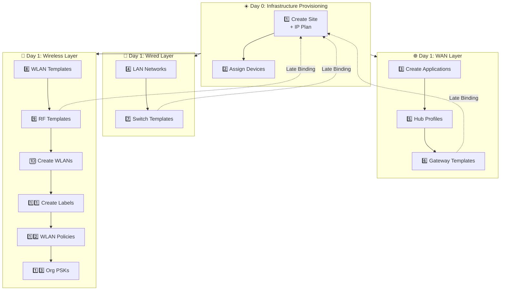

[](https://github.com/ericcgu/juniper-mist-ai/actions)
[](https://www.python.org/downloads/release/python-312/)
[](https://fastapi.tiangolo.com)
[](https://redis.io)
[](https://opensource.org/licenses/MIT)
[](https://railway.app)

# 🚀 Juniper Mist Multi Site Provisioning Service

> **Enterprise Network Automation at Scale** — A Distinguished Engineer-grade FastAPI service implementing Domain-Driven Design for automated Juniper Mist infrastructure deployment.

## 🌐 Live Demo

**[👉 Launch Interactive API Documentation](https://juniper-mist.up.railway.app/)**

---

## 📋 Table of Contents

- [Executive Summary](#-executive-summary)
- [Architecture Overview](#-architecture-overview)
- [The 13-Step Workflow](#-the-13-step-workflow)
- [Technical Highlights](#-technical-highlights)
- [Getting Started](#-getting-started)
- [API Reference](#-api-reference)
- [Project Structure](#-project-structure)
- [Technologies Used](#-technologies-used)

---

## 💼 Executive Summary

This project demonstrates **enterprise-grade network automation** using modern Python and cloud-native principles. It solves a real-world challenge: deploying consistent network infrastructure across hundreds of sites without manual configuration or spreadsheet-based IP planning.

### Key Differentiators

| Traditional Approach | This Solution |
|---------------------|---------------|
| Manual site configuration | Orchestrated 13-step workflow |
| Spreadsheet-based IP planning | Algorithmic subnet calculation |
| One-off scripts | Idempotent, resumable operations |
| Monolithic design | Domain-Driven microservice architecture |
| Manual template binding | Late Binding pattern |

---

## 🏗️ Architecture Overview

```
┌─────────────────────────────────────────────────────────────────────────────┐
│                          FastAPI Application                                 │
├─────────────────────────────────────────────────────────────────────────────┤
│                                                                              │
│  ┌──────────────────────────────────────────────────────────────────────┐  │
│  │                    ORCHESTRATOR LAYER                                 │  │
│  │                                                                       │  │
│  │   POST /orchestrator/deploy-full-stack                               │  │
│  │   ├── Executes all 13 steps in dependency order                      │  │
│  │   ├── Idempotent (safe to retry)                                     │  │
│  │   └── Resumable (skips completed steps)                              │  │
│  └──────────────────────────────────────────────────────────────────────┘  │
│                                    │                                         │
│                    ┌───────────────┼───────────────┐                        │
│                    ▼               ▼               ▼                        │
│  ┌──────────────────────────────────────────────────────────────────────┐  │
│  │                      DOMAIN ROUTERS (DDD)                             │  │
│  ├──────────────┬──────────────┬──────────────┬──────────────┬─────────┤  │
│  │    Sites     │  Inventory   │     WAN      │    Wired     │ Wireless│  │
│  │   (Day 0)    │   (Day 0)    │   (Day 1)    │   (Day 1)    │ (Day 1) │  │
│  ├──────────────┼──────────────┼──────────────┼──────────────┼─────────┤  │
│  │ • Create     │ • Claim      │ • Apps       │ • Networks   │ • RF    │  │
│  │ • IP Plan    │ • Assign     │ • Hub Prof.  │ • Switch     │ • WLANs │  │
│  │ • Config     │ • Track      │ • Gateways   │   Templates  │ • PSKs  │  │
│  └──────────────┴──────────────┴──────────────┴──────────────┴─────────┘  │
│                                    │                                         │
│  ┌──────────────────────────────────────────────────────────────────────┐  │
│  │                       SERVICES LAYER                                  │  │
│  ├─────────────────────────────────┬────────────────────────────────────┤  │
│  │      NetworkCalculator          │         RedisStateStore            │  │
│  │  • Algorithmic IP planning      │  • Deployment state tracking       │  │
│  │  • Zone/Site subnet math        │  • Idempotency enforcement         │  │
│  │  • No spreadsheets required     │  • Resumable workflows             │  │
│  └─────────────────────────────────┴────────────────────────────────────┘  │
│                                    │                                         │
│  ┌──────────────────────────────────────────────────────────────────────┐  │
│  │                      INFRASTRUCTURE                                   │  │
│  │                                                                       │  │
│  │   Redis 8 (State) ◄──► FastAPI ◄──► Juniper Mist Cloud API          │  │
│  └──────────────────────────────────────────────────────────────────────┘  │
└─────────────────────────────────────────────────────────────────────────────┘
```

---

## 🔄 The 13-Step Workflow

The orchestrator executes these steps in precise dependency order:



### Step Details

| Step | Endpoint | Domain | Description |
|:----:|----------|--------|-------------|
| 1 | `POST /sites` | Day 0 | Create site container with algorithmic IP allocation |
| 2 | `POST /inventory/assign` | Day 0 | Assign claimed devices to the site |
| 3 | `POST /wan/applications` | Day 1 | Define application signatures for AppQoE |
| 4 | `POST /wired/networks` | Day 1 | Create VLANs/networks for L2 foundation |
| 5 | `POST /wan/hub-profiles` | Day 1 | Configure SD-WAN overlay topology |
| 6 | `POST /wan/gateway-templates` | Day 1 | Deploy WAN edge (SSR/SRX) configurations |
| 7 | `POST /wired/templates` | Day 1 | Deploy switch port profiles and policies |
| 8 | `POST /wireless/wlan-templates` | Day 1 | Create WLAN template containers |
| 9 | `POST /wireless/rf-templates` | Day 1 | Configure radio parameters |
| 10 | `POST /wireless/wlans` | Day 1 | Define individual SSIDs |
| 11 | `POST /wireless/labels` | Day 1 | Create policy matching labels |
| 12 | `POST /wireless/wxrules` | Day 1 | Deploy wireless security rules |
| 13 | `POST /wireless/org-psks` | Day 1 | Create organization-level PSKs |

---

## ⚡ Technical Highlights

### 🧮 Algorithmic IP Planning

**No more spreadsheets.** IP subnets are calculated mathematically from zone and site identifiers:

```python
# Formula: 10.{zone_id}.{site_id}.0/24
# Zone 1, Site 5 → Management: 10.1.5.0/24
#                → Data:       10.101.5.0/24
#                → Voice:      10.151.5.0/24
```

### 🔁 Idempotent Operations

Every operation is safe to retry. The orchestrator tracks state in Redis:

```python
# Execution flow
if state_store.is_step_completed(site_id, step_num):
    continue  # Skip - already done
    
state_store.start_step(site_id, step_num)
execute_step()
state_store.complete_step(site_id, step_num)
```

### 🎯 Late Binding Pattern

Templates are created before sites, then bound afterward:

```
1. Create Gateway Template → template_id
2. Create Site → site_id
3. Bind: PUT /sites/{site_id}/config {gatewaytemplate_id: ...}
```

### 🔐 Security-First Design

- API Key authentication via `X-Mist-API-Key` header
- Environment-based configuration (no secrets in code)
- Railway internal networking for Redis

---

## 🚀 Getting Started

### Prerequisites

- Python 3.12+
- Redis 8.0+ (or Railway Redis)
- Juniper Mist API token

### Installation

```bash
# Clone the repository
git clone https://github.com/ericcgu/juniper-mist-ai.git
cd juniper-mist-ai

# Create virtual environment
python -m venv .venv
source .venv/bin/activate  # Windows: .venv\Scripts\activate

# Install dependencies
pip install -r requirements.txt

# Configure environment
cp .env.example .env
# Edit .env with your settings
```

### Running Locally

```bash
# Development server
hypercorn src.main:app --reload --bind 0.0.0.0:8000

# Run tests
pytest -v
```

### Deploy to Railway

[](https://railway.app/template)

---

## 📖 API Reference

### Full Stack Deployment

```bash
curl -X POST "https://juniper-mist.up.railway.app/orchestrator/deploy-full-stack" \
  -H "X-Mist-API-Key: your-api-key" \
  -H "Content-Type: application/json" \
  -d '{
    "org_id": "org-123",
    "site_name": "Branch-NYC-001",
    "zone_id": 1,
    "site_id": 5,
    "device_serials": ["ABC123", "DEF456"]
  }'
```

### Response

```json
{
  "site_id": "1-5",
  "status": "completed",
  "current_step": 13,
  "total_steps": 13,
  "message": "13-Step Workflow Executed Successfully for Branch-NYC-001"
}
```

---

## 📁 Project Structure

```
juniper-mist-ai/
├── src/
│   ├── main.py                 # FastAPI application factory
│   ├── config.py               # Pydantic settings management
│   ├── redis.py                # Redis client configuration
│   ├── routers/
│   │   ├── orchestrator.py     # 13-step workflow engine
│   │   ├── sites.py            # Day 0: Site provisioning
│   │   ├── inventory.py        # Day 0: Device management
│   │   ├── wan.py              # Day 1: SD-WAN configuration
│   │   ├── wired.py            # Day 1: Switch templates
│   │   └── wireless.py         # Day 1: WLAN & RF config
│   └── services/
│       ├── network_calculator.py  # Algorithmic IP planning
│       └── redis_store.py         # State management
├── tests/
│   └── test_main.py
├── requirements.txt
├── railway.json
└── README.md
```

---

## 🛠️ Technologies Used

| Technology | Purpose | Version |
|------------|---------|---------|
| **FastAPI** | Async web framework | 0.115.0 |
| **Python** | Runtime | 3.12 |
| **Redis** | State management | 7.1.0 (client) / 8.0 (server) |
| **Pydantic** | Data validation & settings | 2.7.0 |
| **Hypercorn** | ASGI server | 0.14.4 |
| **Railway** | Cloud deployment | - |
| **GitHub Actions** | CI/CD pipeline | - |
| **mistapi** | Juniper Mist SDK | 0.55.8 |

---

## 🤝 Contributing

Contributions are welcome! Please:

1. Fork the repository
2. Create a feature branch (`git checkout -b feature/amazing-feature`)
3. Commit your changes (`git commit -m 'Add amazing feature'`)
4. Push to the branch (`git push origin feature/amazing-feature`)
5. Open a Pull Request

---

## 📝 License

This project is licensed under the MIT License - see the [LICENSE.md](LICENSE.md) file for details.

---

## 👤 Author

**Eric Gu**

- GitHub: [@ericcgu](https://github.com/ericcgu)
- LinkedIn: [Connect with me](https://linkedin.com/in/ericcgu)

---

<p align="center">
  <i>Built with ❤️ for network automation excellence</i>
</p>
